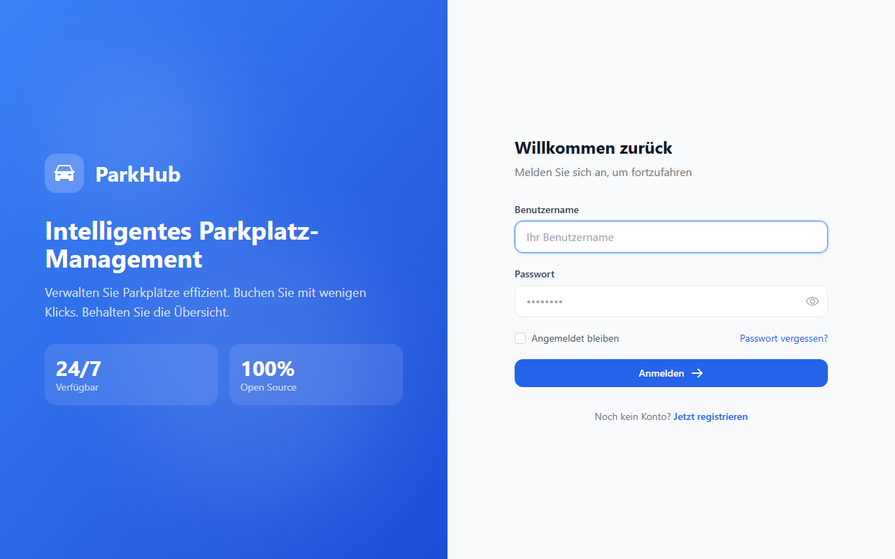
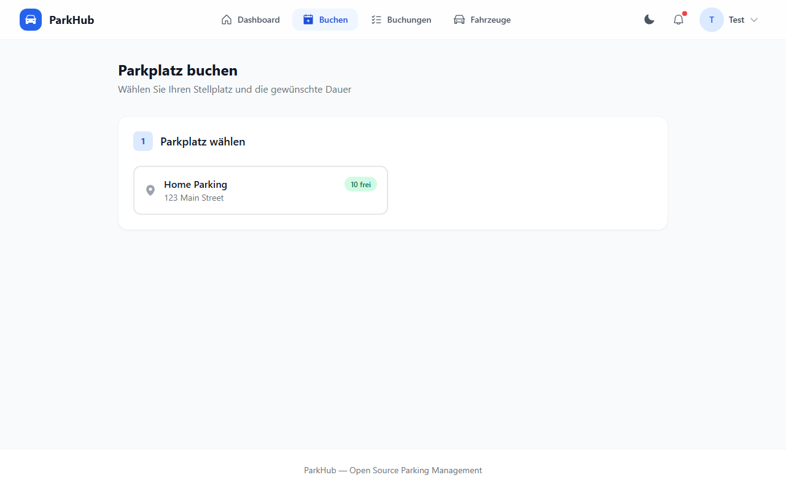
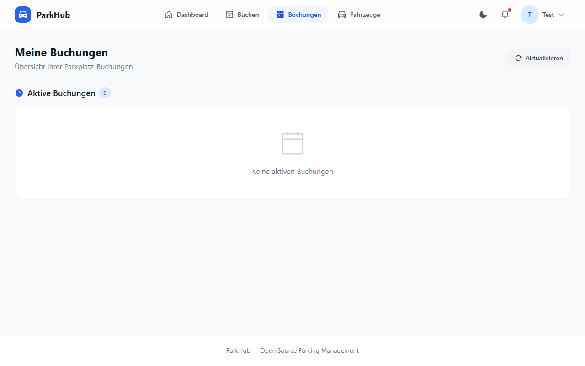
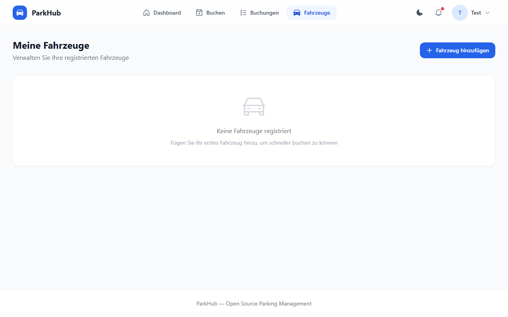
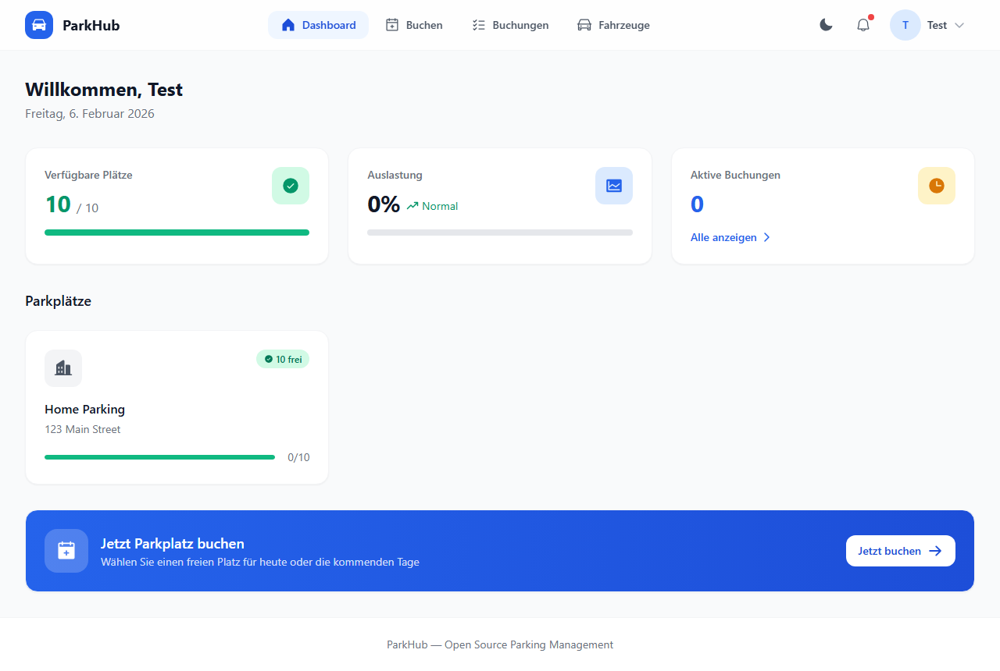
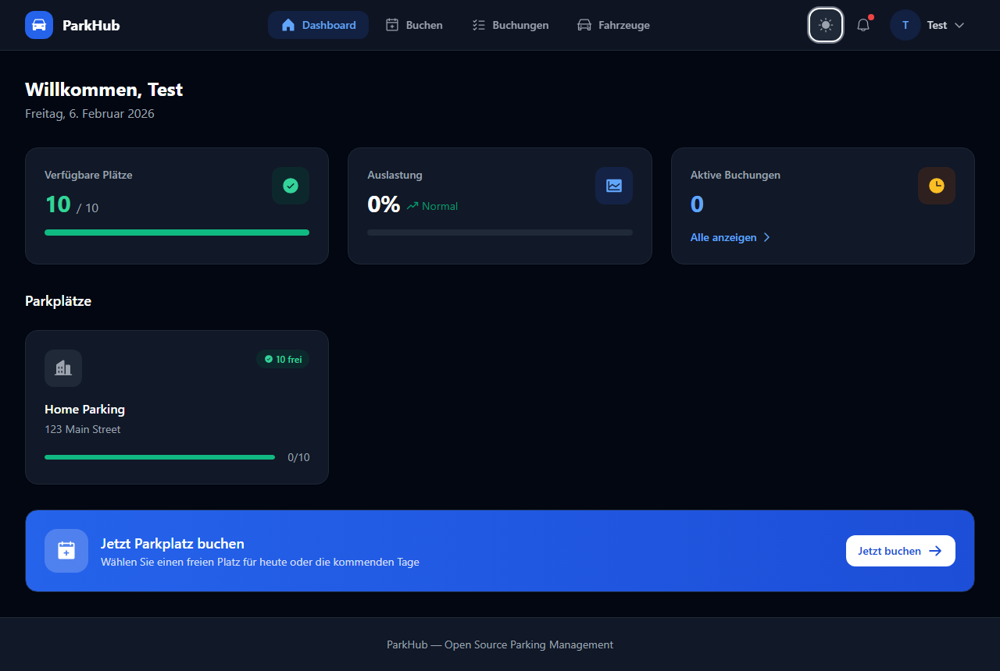

<p align="center">
  
</p>

<h1 align="center">ParkHub Rust — Self-Hosted Parking Management</h1>

<p align="center">
  <a href="https://www.rust-lang.org/"></a>
  <a href="LICENSE"></a>
  <a href="docs/CHANGELOG.md"></a>
  <a href="https://react.dev/"></a>
  <a href="docs/GDPR.md"></a>
  <a href="docker-compose.yml"></a>
</p>

<p align="center">
  <strong>Ihre Daten. Ihr Server. Ihre Kontrolle.</strong><br>
  The on-premise parking management platform for enterprises, universities, and residential complexes.<br>
  Zero cloud. Zero tracking. 100% GDPR compliant by design.
</p>

<p align="center">
  <a href="docs/INSTALLATION.md">Installation</a> ·
  <a href="docs/API.md">API Reference</a> ·
  <a href="docs/GDPR.md">GDPR Guide</a> ·
  <a href="docs/CONFIGURATION.md">Configuration</a> ·
  <a href="docs/CHANGELOG.md">Changelog</a>
</p>

---

## Why ParkHub?

> Self-hosted means YOUR data never leaves YOUR server. No US cloud providers. No CLOUD Act risks.
> No data processing agreements needed — because there is no data processor.

| | ParkHub (self-hosted) | SaaS Alternatives |
|---|---|---|
| Your data location | Your server | Provider's cloud |
| GDPR processor agreement | Not needed | Required |
| Monthly SaaS fee | €0 | €200–2,000/month |
| US CLOUD Act exposure | None | Possible |
| Source code auditable | MIT License | Proprietary |
| German legal templates | Included | Extra cost |
| Single binary, zero deps | Yes | N/A |
| Works offline / LAN-only | Yes | No |

---

## Features

### Booking Management

| Feature | Status |
|---|---|
| Booking flow: lot → slot → duration → vehicle → confirm | Done |
| Quick booking (one tap, system picks best available slot) | Done |
| Booking cancellation with automatic slot release | Done |
| Full booking history (active, past, cancelled) | Done |
| Booking invoice endpoint | Done |
| Favorite slots per user | Done |
| Email notifications (SMTP) | Planned |
| Booking swap requests | Planned |

### Parking Lot Management

| Feature | Status |
|---|---|
| Create and manage multiple lots | Done |
| Visual slot layout editor (per-floor grid) | Done |
| Interactive slot grid (available / occupied / reserved / favorites) | Done |
| Per-slot status management | Done |
| Real-time occupancy statistics | Done |

### User Management

| Feature | Status |
|---|---|
| User registration and login (username or email) | Done |
| Role-based access control: user / admin / superadmin | Done |
| JWT-style session authentication (24-hour expiry) | Done |
| Token refresh | Done |
| Password reset via email | Done |
| Vehicle registry (plate, make, model, color, default flag) | Done |
| Full admin user management (list, role change, status, delete) | Done |

### GDPR & Legal

| Feature | Status |
|---|---|
| Art. 15 — full personal data export as JSON | Done |
| Art. 17 — account erasure (PII anonymized, bookings kept per §147 AO) | Done |
| DDG §5 Impressum — admin-editable, always publicly accessible | Done |
| Legal templates: Impressum, Datenschutz, AGB, AVV | Done |
| Cookie consent UI | Done |
| GDPR self-service portal in user dashboard | Done |

### Security

| Feature | Status |
|---|---|
| Argon2id password hashing (OsRng salts) | Done |
| AES-256-GCM database encryption at rest (optional) | Done |
| TLS 1.3 (auto-generated cert or bring-your-own) | Done |
| Rate limiting: 5 login attempts/min per IP, 100 req/s global | Done |
| Security headers: CSP, X-Frame-Options, Referrer-Policy, Permissions-Policy | Done |
| Request body size limit (1 MiB) | Done |
| CORS: same-origin (localhost allowed in dev) | Done |
| Audit logging | Done |

### Administration

| Feature | Status |
|---|---|
| Admin dashboard with occupancy stats and lot overview | Done |
| Inline slot layout editor | Done |
| Admin booking overview | Done |
| Impressum editor in admin panel | Done |
| Prometheus metrics endpoint (`/metrics`) | Done |
| Swagger UI at `/swagger-ui` | Done |
| Automatic daily backups with configurable retention | Done |

### Deployment

| Feature | Status |
|---|---|
| Docker Compose (single-file, zero-config) | Done |
| Kubernetes with health probes (`/health`, `/health/live`, `/health/ready`) | Done |
| Windows GUI (system tray + setup wizard) | Done |
| Headless / unattended server mode | Done |
| mDNS LAN autodiscovery (no DNS setup needed) | Done |
| React frontend embedded in single Rust binary | Done |
| Dark mode and light mode | Done |
| Mobile-responsive UI | Done |
| Accessibility (ARIA labels, keyboard navigation, screen reader) | Done |

---

## Quick Start (3 commands)

```bash
git clone https://github.com/nash87/parkhub-rust.git
cd parkhub-rust
docker compose up -d
```

Open **http://localhost:8080** in your browser.
Default credentials: `admin` / `admin` — **change immediately after first login**.

To run without Docker (single binary):

```bash
cargo build --release --package parkhub-server
./target/release/parkhub-server --headless --unattended
```

The binary serves the full React frontend — no web server or reverse proxy needed.

---

## Screenshots

| Screenshot | Description |
|---|---|
|  | Clean login page with dark/light mode |
|  | Dashboard: occupancy stats and lot overview |
|  | Booking flow with interactive slot grid |
|  | Active and past bookings |
|  | Vehicle management |
|  | Admin panel with layout editor |
|  | Dark mode |

---

## Architecture

```
Browser (React 19 SPA — TypeScript + Tailwind CSS)
  |  Served as static files embedded in the Rust binary
  |  Bearer token (JWT-style UUID session, 24h expiry)
  v
Axum 0.7  (Rust 1.84+, async Tokio runtime)
  |
  +-- /api/v1/*      REST API (auth required, RBAC enforced)
  +-- /metrics       Prometheus (unauthenticated)
  +-- /swagger-ui    OpenAPI 3.0 documentation
  +-- /health*       Kubernetes liveness + readiness probes
  +-- /api/v1/legal  Public legal pages (DDG §5 Impressum)
  |
  +-- redb  (embedded single-file database)
  |     Optional: AES-256-GCM encryption at rest
  |     Data dir: ./data/  (portable) or /data  (Docker)
  |
  +-- SMTP  (optional — email notifications, password reset)
```

The entire stack ships as a **single Rust binary** with the React frontend embedded.
No external database server, no reverse proxy, no separate static file server required.

---

## Installation

| Platform | Guide | Difficulty |
|---|---|---|
| Docker Compose | [docs/INSTALLATION.md](docs/INSTALLATION.md#docker-compose-recommended) | Easy |
| Kubernetes / Flux GitOps | [docs/INSTALLATION.md](docs/INSTALLATION.md#kubernetes) | Medium |
| Bare metal (VPS / server) | [docs/INSTALLATION.md](docs/INSTALLATION.md#bare-metal) | Medium |
| Windows (GUI installer) | [docs/INSTALLATION.md](docs/INSTALLATION.md#windows) | Easy |
| TLS + reverse proxy (nginx, Caddy, Traefik) | [docs/INSTALLATION.md](docs/INSTALLATION.md#tls) | Medium |

---

## GDPR & German Legal Compliance

ParkHub is designed for on-premise deployment in German-regulated environments.
Because all data stays on your server, **no Auftragsverarbeitungsvertrag (AVV) with a cloud provider is needed**.

| GDPR Article | Endpoint | Notes |
|---|---|---|
| Art. 15 — Auskunftsrecht | `GET /api/v1/users/me/export` | Full JSON export: profile, bookings, vehicles |
| Art. 17 — Recht auf Loschung | `DELETE /api/v1/users/me/delete` | Anonymizes all PII fields |
| Art. 17 + §147 AO | Booking records | Retained 10 years (German tax law), PII anonymized |
| DDG §5 — Impressum | `GET /api/v1/legal/impressum` | Public endpoint, admin-editable |

**Legal templates included** in `legal/`:
- `impressum-template.md` — DDG §5 Impressum
- `datenschutz-template.md` — Datenschutzerklarung
- `agb-template.md` — Allgemeine Geschaftsbedingungen
- `avv-template.md` — Auftragsverarbeitungsvertrag

See [docs/GDPR.md](docs/GDPR.md) for the full operator compliance checklist.

---

## Security

- **Passwords**: Argon2id hashing — never stored in plaintext
- **Database**: optional AES-256-GCM encryption at rest via PBKDF2-derived key
- **Transport**: TLS 1.3 — auto-generated self-signed cert or custom certificate
- **Rate limiting**: 5 login/register attempts per minute per IP; 100 req/s global (burst 200)
- **Security headers**: Content-Security-Policy, X-Frame-Options: DENY, Referrer-Policy, Permissions-Policy
- **Request size**: 1 MiB limit on all request bodies (prevents DoS via large payloads)
- **CORS**: same-origin only (localhost allowed in development)
- **RBAC**: user / admin / superadmin roles enforced independently on every endpoint
- **Audit log**: every write operation recorded with timestamp and user ID

See [docs/SECURITY.md](docs/SECURITY.md) for the full security model.

---

## Configuration

Key environment variables (full list in [docs/CONFIGURATION.md](docs/CONFIGURATION.md)):

| Variable | Default | Description |
|---|---|---|
| `PARKHUB_HOST` | `0.0.0.0` | Bind address |
| `PARKHUB_PORT` | `8080` | Listen port |
| `PARKHUB_DB_PASSPHRASE` | — | Enables AES-256-GCM at-rest encryption |
| `PARKHUB_TLS_CERT` | — | Path to TLS certificate (PEM) |
| `PARKHUB_TLS_KEY` | — | Path to TLS private key (PEM) |
| `PARKHUB_SMTP_HOST` | — | SMTP server for email notifications |
| `PARKHUB_SMTP_PORT` | `587` | SMTP port |
| `PARKHUB_SMTP_USER` | — | SMTP username |
| `PARKHUB_SMTP_PASS` | — | SMTP password |
| `RUST_LOG` | `info` | Log level (`debug`, `info`, `warn`, `error`) |

---

## API Reference

Swagger UI is available at `/swagger-ui` when the server is running.

Quick example — list parking lots:

```bash
TOKEN=$(curl -s -X POST http://localhost:8080/api/v1/auth/login \
  -H "Content-Type: application/json" \
  -d '{"username":"admin","password":"admin"}' | jq -r '.data.access_token')

curl -H "Authorization: Bearer $TOKEN" http://localhost:8080/api/v1/lots
```

See [docs/API.md](docs/API.md) for the complete REST API reference with curl examples.

---

## Documentation Index

| Document | Purpose |
|---|---|
| [docs/INSTALLATION.md](docs/INSTALLATION.md) | Full installation guide (Docker, K8s, bare metal, Windows) |
| [docs/CONFIGURATION.md](docs/CONFIGURATION.md) | Every environment variable documented |
| [docs/API.md](docs/API.md) | Full REST API reference with curl examples |
| [docs/GDPR.md](docs/GDPR.md) | Operator DSGVO compliance checklist |
| [docs/SECURITY.md](docs/SECURITY.md) | Security model and responsible disclosure |
| [docs/CHANGELOG.md](docs/CHANGELOG.md) | Release history |
| [docs/CONTRIBUTING.md](docs/CONTRIBUTING.md) | Development setup and PR process |
| [legal/impressum-template.md](legal/impressum-template.md) | German Impressum template (DDG §5) |
| [legal/datenschutz-template.md](legal/datenschutz-template.md) | Datenschutzerklarung template |
| [legal/agb-template.md](legal/agb-template.md) | AGB template |
| [legal/avv-template.md](legal/avv-template.md) | Auftragsverarbeitungsvertrag template |

---

## License

MIT — see [LICENSE](LICENSE).

---

## Contributing

Contributions welcome. See [docs/CONTRIBUTING.md](docs/CONTRIBUTING.md) for the development setup,
testing workflow, and PR process.

Bug reports and feature requests: use the [GitHub issue tracker](https://github.com/nash87/parkhub-rust/issues).
