<p align="center">
  
</p>

<h1 align="center">ParkHub — Self-Hosted Parking Management</h1>

<p align="center">
  <a href="https://github.com/nash87/parkhub-rust/actions/workflows/ci.yml"></a>
  <a href="CHANGELOG.md"></a>
  <a href="LICENSE"></a>
  <a href="https://www.rust-lang.org/"></a>
  <a href="https://astro.build/"></a>
  <a href="https://react.dev/"></a>
  <a href="https://tailwindcss.com/"></a>
  
  <a href="docs/GDPR.md"></a>
  <a href="COMPLIANCE-REPORT.md"></a>
  <a href="docker-compose.yml"></a>
</p>

<p align="center">
  <strong>Ihre Daten. Ihr Server. Ihre Kontrolle.</strong><br>
  The on-premise parking management runtime for the canonical ParkHub product.<br>
  Ships as a <strong>single binary</strong> with zero external dependencies. Zero cloud. Zero tracking.<br>
  100% GDPR compliant by design.
</p>

<p align="center">
  <a href="https://parkhub-rust-demo.onrender.com"><strong>🚀 Try the Live Demo</strong></a> &nbsp;·&nbsp;
  <a href="docs/INSTALLATION.md">Installation</a> &nbsp;·&nbsp;
  <a href="docs/API.md">API Docs</a> &nbsp;·&nbsp;
  <a href="docs/GDPR.md">GDPR Guide</a> &nbsp;·&nbsp;
  <a href="docs/COMPLIANCE.md">Compliance</a> &nbsp;·&nbsp;
  <a href="docs/SECURITY.md">Security</a> &nbsp;·&nbsp;
  <a href="CHANGELOG.md">Changelog</a>
</p>

---

## Design v5 Showcase

<table>
  <tr>
    <td>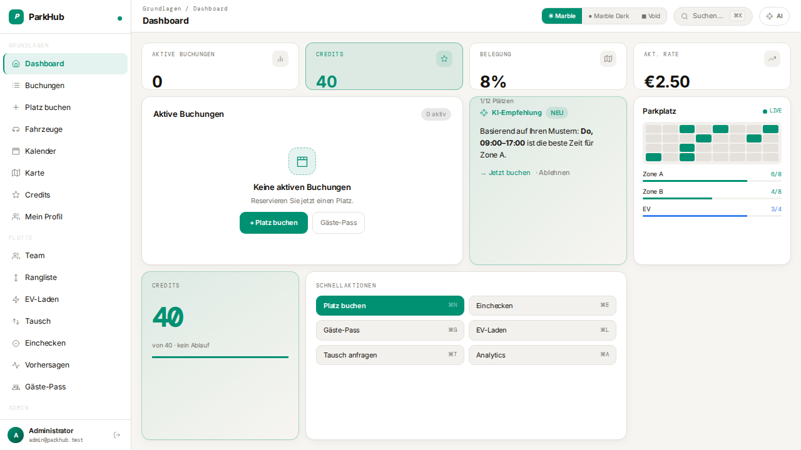</td>
    <td>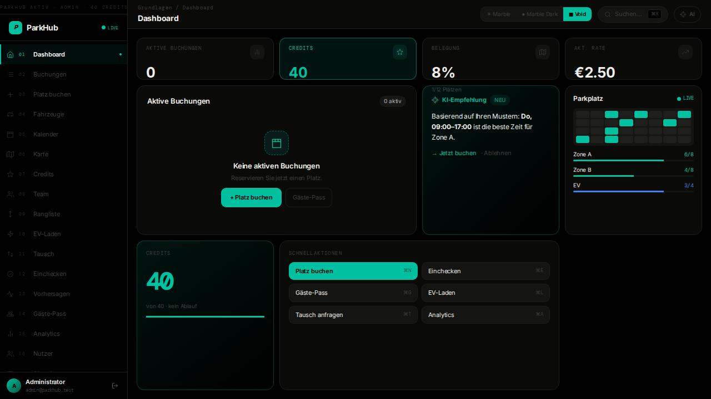</td>
  </tr>
  <tr>
    <td>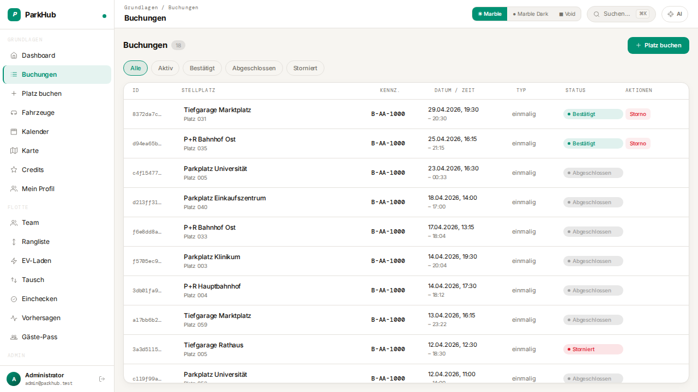</td>
    <td>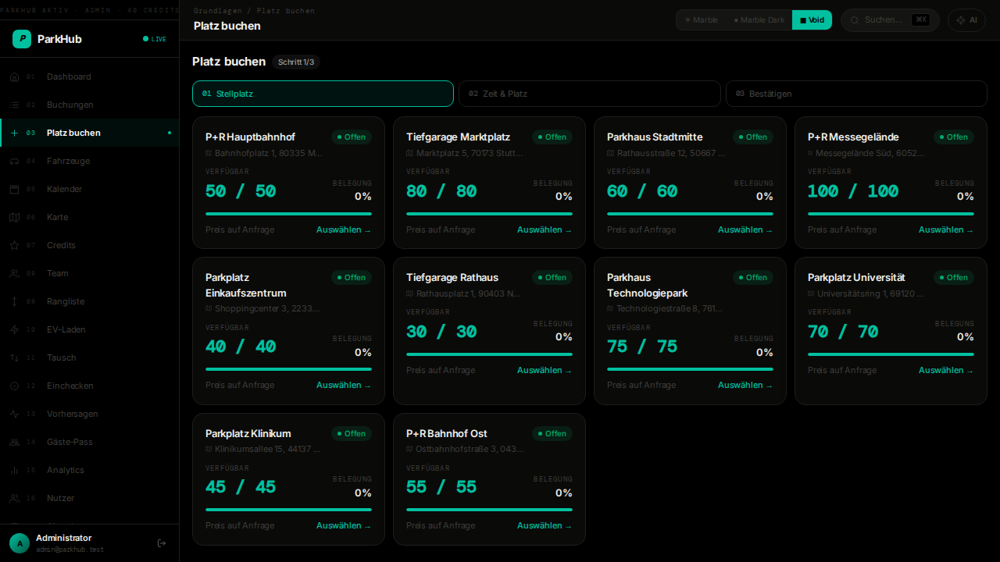</td>
  </tr>
  <tr>
    <td>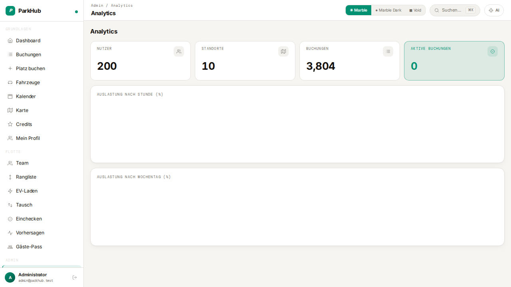</td>
    <td>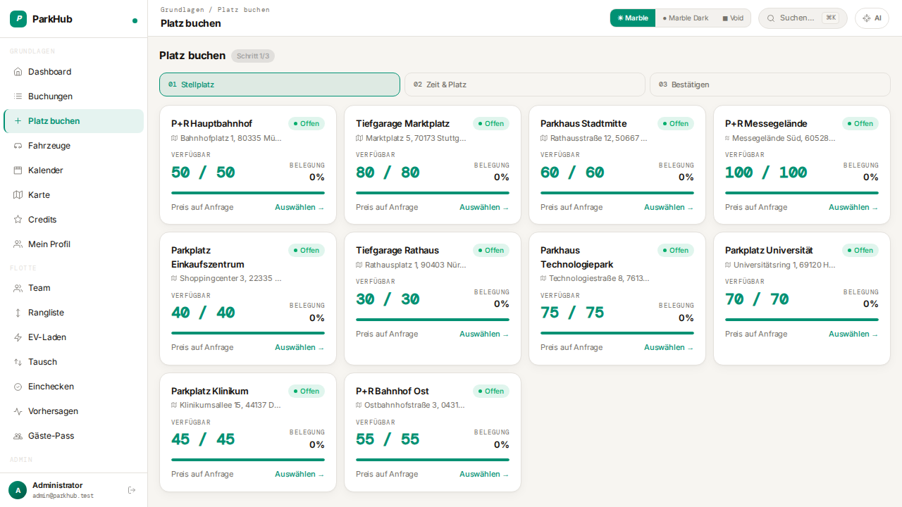</td>
  </tr>
</table>

> Live demo: <a href="https://parkhub-rust-demo.onrender.com">parkhub-rust-demo.onrender.com</a> · drücke <kbd>⌘K</kbd> / <kbd>Ctrl</kbd>+<kbd>K</kbd> für die Command-Palette · <kbd>?</kbd> blendet das Help-Overlay ein.

---

## Design v5 Status (26 / 26 screens shipped)

| Surface | Status |
|---------|--------|
| **All navigation screens** | 26 / 26 ported to `src/design-v5/` — the `<PlaceholderV5>` fallback has been retired. |
| **Themes** | OKLCH tokens across `marble_light`, `marble_dark`, `void` — self-hosted Inter-Variable keeps the LCP budget green. |
| **Command Palette** | cmdk-powered, mounted globally, reachable from every route with `⌘K` / `Ctrl+K`. |
| **Realtime** | Live cells hydrate from `/api/v1/events/stream` (SSE) with a polling fallback; charts render via uPlot. |
| **Accessibility** | axe-core runs in CI on every v5 route; keyboard-only nav verified for the full shell + Assistent panel. |
| **Types** | `ts-rs` generates `src/generated/types/*` from the Rust backend so Fleet events stay type-safe end-to-end. |

Live demo: <https://parkhub-rust-demo.onrender.com>.

---

## What's New in v4.14.2

| Feature | Description |
|---------|-------------|
| **Modular UX Platform** | 72-module registry with admin dashboard at `/admin/modules`, runtime enable/disable toggle for safe modules, per-module JSON Schema config editor, and Command Palette (`Cmd+K` / `Ctrl+K` / `/`). See [docs/FEATURES.md § Modular UX Platform](docs/FEATURES.md#4-modular-ux-platform) |
| **Backend refactors** | `db.rs` (4528 LOC), `api/mod.rs` router, and `api/modules.rs` (3066 LOC) split into focused sub-modules; `main.rs` bootstrap helpers extracted for testability |
| **Security hardening** | Cross-tenant admin write guards on user updates; async lock scopes tightened under load |
| **Testing depth** | `cargo-fuzz` harnesses for JWT + HMAC (nightly), `proptest` on `parkhub-common` validators, `cargo-mutants` weekly, `insta` snapshot tests |
| **OpenAPI coverage closed** | Pass 1 + pass 2 wired 280 of 282 annotated handlers (99.3 %) into `ApiDoc`; spec at [`docs/openapi/rust.json`](docs/openapi/rust.json) now exposes **229 paths** and regenerates on every schema change |
| **Runtime toolchain refresh** | Rust builder bumped to `rust:1.95-slim`; distroless runtime base pinned to `cc-debian13@sha256:56aaf20…` |

---

## Product Model

ParkHub is one product with multiple runtimes. This Rust edition shares the same core product model as the PHP edition, while keeping a Rust-first deployment story: single binary, embedded storage, and local-first operation.

Not every advanced module is equally hardened or equally enabled by default across runtimes. Treat the shared booking, admin, compliance, and theme surfaces as the core product line; treat advanced integrations and enterprise modules as optional and runtime-sensitive.

Cross-runtime ownership and release discipline live in [docs/parity-governance.md](docs/parity-governance.md) and [docs/release-checklist.md](docs/release-checklist.md).

---

## 💡 Why Self-Hosted?

Most parking management SaaS costs 200–2,000 EUR/month, stores your data on US cloud infrastructure, and requires a data processing agreement just to get started.

ParkHub is different. It runs on your server — a Raspberry Pi, a VPS, or your company network. Your data never leaves your premises, which means **no GDPR processor agreement needed**, no CLOUD Act exposure, and no monthly fees. The entire source code is MIT-licensed and auditable.

---

## 🚀 Quick Start

### 🐳 Docker (recommended)

```bash
git clone https://github.com/nash87/parkhub-rust.git && cd parkhub-rust
cp .env.example .env
# Edit .env and set a strong PARKHUB_ADMIN_PASSWORD before first start
docker compose up -d
# Open http://localhost:8080
```

The first build takes 5–10 minutes (compiles Rust + React from source). After that, starts are instant.

### 📦 Pre-built binary

Download the latest release binary from [GitHub Releases](https://github.com/nash87/parkhub-rust/releases/latest) (built automatically by CI on every tagged release):

```bash
# Linux x86_64
curl -Lo parkhub-linux-x64.tar.gz https://github.com/nash87/parkhub-rust/releases/latest/download/parkhub-linux-x64.tar.gz
tar -xzf parkhub-linux-x64.tar.gz
./parkhub-linux-x64/parkhub-server --headless --unattended --port 8080
```

### 🔨 Build from source

```bash
git clone https://github.com/nash87/parkhub-rust.git && cd parkhub-rust
# Default build is pure MIT and headless (no GUI):
cargo build --release --package parkhub-server
./target/release/parkhub-server --headless --unattended --port 8080
```

To build the optional desktop GUI (pulls Slint, which is GPL-3.0 — see [LICENSES.md](LICENSES.md)):

```bash
cargo build --release --package parkhub-server --features gui
```

**[Live Demo](https://parkhub-rust-demo.onrender.com)** | Login: `admin@parkhub.test` / `demo` | (auto-resets every 6 hours)

---

## ✨ Feature Highlights

### 🏢 Core Platform
- **Full booking lifecycle** — one-tap quick booking, recurring reservations, guest bookings, swap requests, waitlists, automatic no-show release
- **Visual lot editor** — per-floor interactive grid with drag-and-drop, real-time occupancy, color-coded availability
- **4-tier RBAC** — user, premium, admin, superadmin with JWT session auth and token refresh
- **Credits system** — monthly quotas with per-booking deduction
- **Absence tracking** — homeoffice, vacation, sick leave with team overview and iCal import
- **Admin dashboard** — occupancy stats, 7-day booking charts, weekday/hour heatmaps, CSV export, announcements

### 🌍 Localization & Accessibility
- **10 languages** — EN, DE, FR, ES, IT, PT, TR, PL, JA, ZH with runtime hot-loading
- **12 switchable themes** — theme switching is part of the product contract, but the exact runtime theme set is still being pulled onto a shared semantic registry and parity gate
- **Accessible parking** — `is_accessible` slots with 30-min priority booking, admin toggle, stats

### 🎨 Theme Contract
- **Shared product surface** — themes are a core ParkHub surface, not decorative runtime extras
- **Semantic parity first** — theme switching must preserve state clarity, hierarchy, contrast, and critical controls across runtimes
- **Registry alignment in progress** — Rust and PHP currently expose different concrete theme inventories, so public naming is gated until both runtimes match the shared registry

### 🔌 Integrations & Extensions
- **Webhooks v2** — HMAC-SHA256 signed event delivery with retry logic and delivery logs
- **iCal Calendar Sync** — subscribe to bookings from Google Calendar, Outlook, or Apple Calendar
- **Web Push notifications** — VAPID-based push with action buttons and service worker handler
- **Stripe payments** — checkout sessions, webhook handler, payment history, self-service config
- **OAuth/Social login** — self-service Google + GitHub OAuth
- **Enterprise identity (optional)** — SAML/SSO and other advanced identity flows are runtime-sensitive and should be treated as optional enterprise modules, not as baseline auth
- **GraphQL API** — full schema alongside REST with interactive GraphiQL playground
- **Plugin/extension system** — trait-based plugin architecture with event hooks

### 📊 Analytics & Operations
- **Admin analytics dashboard** — daily bookings/revenue charts, peak hours heatmap, top lots, user growth
- **CO₂ tracking** — per-booking CO₂ estimates via `FuelType` enum + `/api/v1/bookings/co2-summary` (carpool detection, dashboard KPI tile, 10-locale copy)
- **Prometheus metrics** — `/metrics` endpoint for Grafana/K8s monitoring
- **Audit log** — full audit trail with UI, filtering, and multi-format export (PDF, CSV, JSON)
- **Scheduled reports** — automated daily/weekly/monthly email digests
- **k6 load tests** — smoke, load, stress, and spike test scripts in `tests/load/`
- **Lighthouse CI** — accessibility ≥ 95, performance ≥ 90, SEO ≥ 95 gates

### 🔔 Notification Contract
- **Core notifications** — in-app notifications plus transactional email
- **Advanced notifications** — Web Push via VAPID where configured
- **Gated channels** — SMS/WhatsApp-style channels should be treated as gated unless explicitly proven operational in the active runtime

### 🎟️ Guest and Pass Contract
- **Core guest flow** — guest bookings and host-visible guest handling
- **Advanced pass flow** — digital passes, QR generation, visitor pre-registration, and check-in surfaces
- **Runtime-sensitive surfaces** — QR/check-in/public verification flows should be treated as advanced and runtime-sensitive, not as unconditional baseline behavior

### 🔒 Security
- **httpOnly cookie auth** with SameSite=Lax (XSS-proof, Bearer fallback for APIs)
- **Argon2id** password hashing (wrapped in spawn_blocking)
- **Optional AES-256-GCM** database encryption at rest
- **Auto-generated TLS 1.3** certificates (rustls, no OpenSSL)
- **Constant-time token comparison** (subtle crate)
- **IP-based rate limiting** — 5 login/min, 100 req/s global
- **Nonce-based CSP + HSTS** + security headers
- **2FA/TOTP** — QR code enrollment, backup codes, per-account enable/disable
- **Session management** — list and revoke active tokens, login history with IP/user-agent
- **Complete audit log** — every write operation recorded

### 🔐 Auth Contract
- **Core auth** — login, registration, password reset, RBAC, 2FA/TOTP, session management
- **Integration auth** — OAuth providers such as Google and GitHub
- **Enterprise identity** — SAML/SSO and similar flows remain optional and runtime-sensitive

### 🧩 Modularity
**72 modules** across 11 categories in a single declarative registry, all exposed in the admin dashboard at `/admin/modules`. 15 are safe to flip on/off at runtime via `PATCH /api/v1/admin/modules/{name}`; 5 ship JSON Schema config editors at `PATCH /api/v1/admin/modules/{name}/config`. Every toggle and config write lands in the audit log. A Command Palette (`Cmd+K` / `Ctrl+K` / `/`) auto-seeds "Go to…" entries for every active module with a UI route. Compile-time: build only what you need via `--features "headless,mod-..."`. See [ARCHITECTURE.md § Module System](ARCHITECTURE.md#module-system) and [docs/FEATURES.md § Modular UX Platform](docs/FEATURES.md#4-modular-ux-platform).

---

## 📸 Screenshots

| | |
|---|---|
| 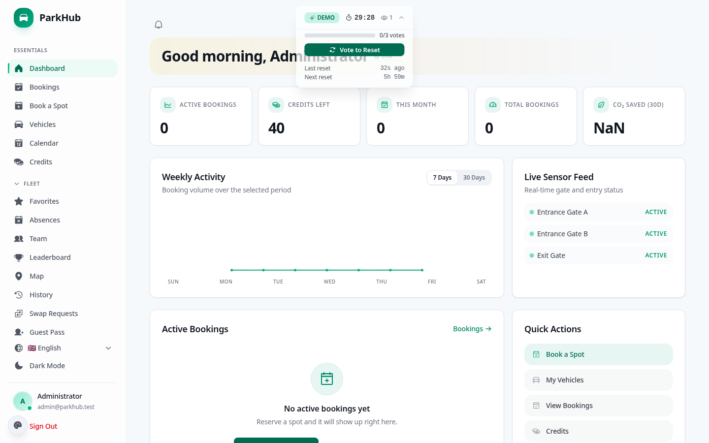 | 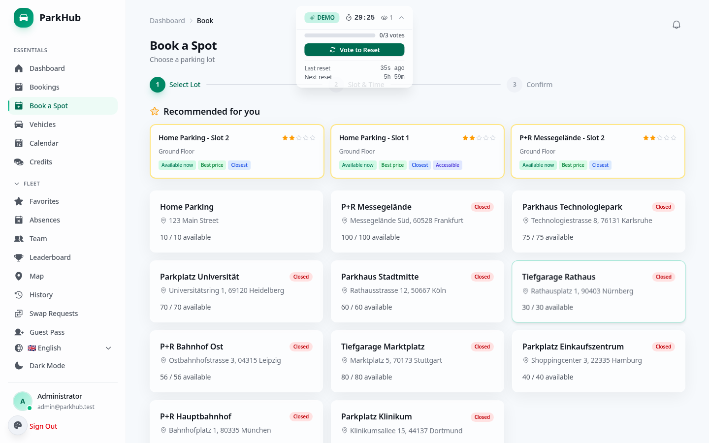 |
| Dashboard with occupancy stats | Interactive booking flow |
| 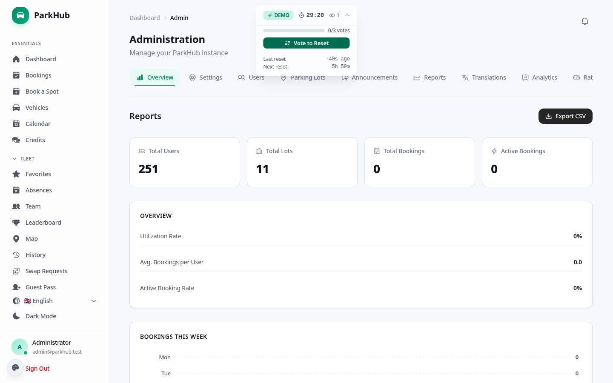 |  |
| Admin panel with layout editor | Full dark mode support |
| 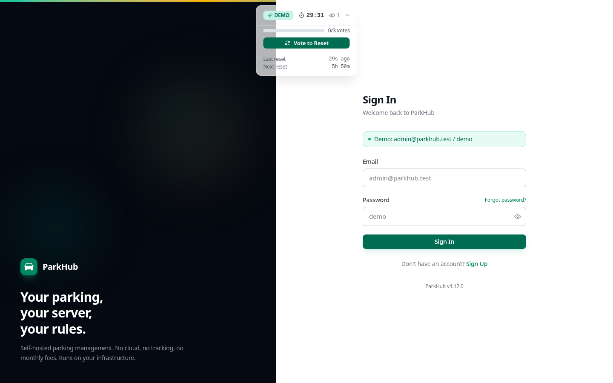 | 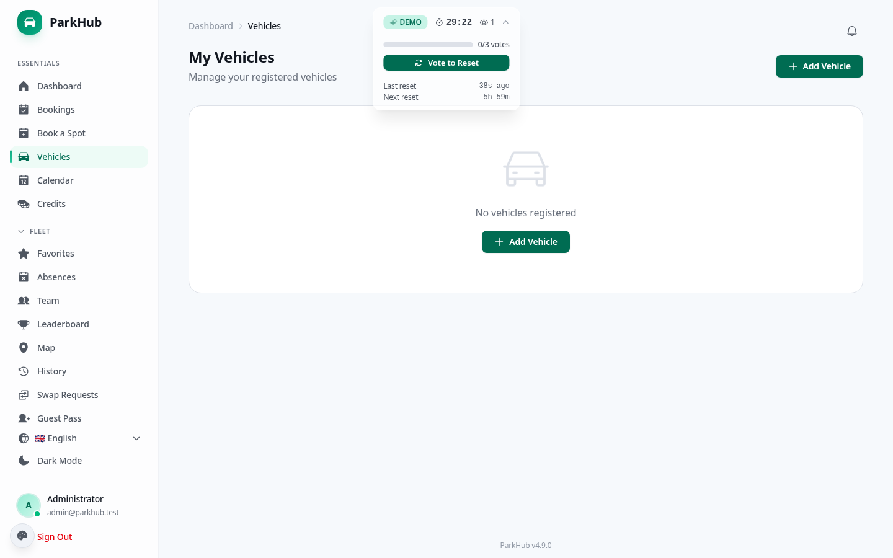 |
| Clean login screen | Vehicle registry |
| 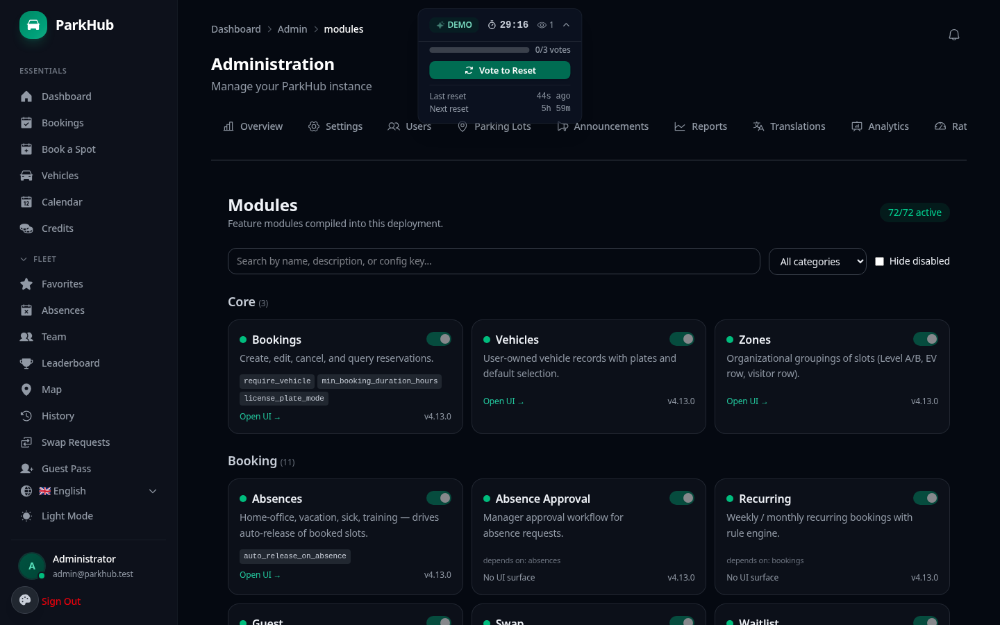 | 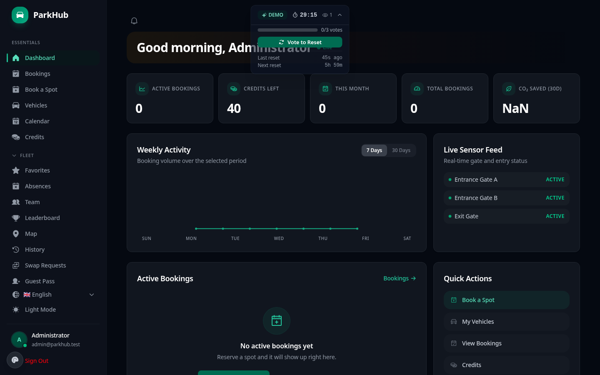 |
| Admin Modules Dashboard — toggle plugins + edit JSON-schema config without redeploying (v4.13.0) | Command Palette (Cmd+K) — navigate + run actions from one search bar |

---

## 🛠️ Tech Stack

| Layer | Technology |
|-------|-----------|
| **Language** | [Rust](https://www.rust-lang.org/) 1.94+ (edition 2024) |
| **HTTP Framework** | [Axum](https://github.com/tokio-rs/axum) 0.8 + [Tokio](https://tokio.rs/) async runtime |
| **Database** | [redb](https://github.com/cberner/redb) 2 — embedded pure-Rust key-value store |
| **Encryption** | AES-256-GCM at rest · Argon2id passwords · rustls TLS 1.3 |
| **Frontend** | [React](https://react.dev/) 19 + [TypeScript](https://www.typescriptlang.org/) + [Astro](https://astro.build/) 6 |
| **Styling** | [Tailwind CSS](https://tailwindcss.com/) 4 — 12 switchable themes |
| **API Docs** | [utoipa](https://github.com/juhaku/utoipa) + Swagger UI — full OpenAPI 3.0 spec at [`docs/openapi/rust.json`](docs/openapi/rust.json), 229 paths, drift-gated in CI |
| **Desktop Client** | [Slint](https://slint.dev/) GUI with system tray (Windows/macOS) |
| **Service Discovery** | [mdns-sd](https://github.com/keepsimple1/mdns-sd) — zero-config LAN autodiscovery |
| **Deployment** | Single binary · Docker · Helm chart · Render/Koyeb PaaS |

---

## ⚖️ How ParkHub Compares

| Feature | **ParkHub** | Parkeon | ParkMobile | SpotHero |
|---------|-------------|---------|------------|---------|
| **Self-hosted / On-premise** | ✅ Yes | ❌ No | ❌ No | ❌ No |
| **Open source** | ✅ MIT | ❌ No | ❌ No | ❌ No |
| **Monthly SaaS fee** | 🆓 Free | 💰 High | 💰 High | 💰 High |
| **GDPR compliant by default** | ✅ Yes | ⚠️ Contract needed | ⚠️ Contract needed | ⚠️ Contract needed |
| **Data leaves your premises** | ✅ Never | ❌ Always | ❌ Always | ❌ Always |
| **Single binary deployment** | ✅ Yes | ❌ No | ❌ No | ❌ No |
| **Customizable / Extensible** | ✅ 72 modules · runtime toggles · JSON Schema config | ❌ No | ❌ No | ❌ No |
| **Multi-language UI** | ✅ 10 languages | ⚠️ Limited | ⚠️ Limited | ⚠️ Limited |
| **API access** | ✅ Full REST + GraphQL | ⚠️ Enterprise only | ⚠️ Limited | ⚠️ Limited |
| **Air-gapped deployment** | ✅ Yes | ❌ No | ❌ No | ❌ No |

> *ParkHub is designed for organizations that need full data sovereignty. SaaS tools are optimized for consumer/enterprise cloud use cases.*

---

## 🏗️ Architecture

```
                    ┌─────────────────────────────────┐
                    │     React 19 + Astro 6 SPA      │
                    │   TypeScript · Tailwind CSS 4    │
                    └───────────────┬─────────────────┘
                                    │ httpOnly Cookie + Bearer Token
                    ┌───────────────▼─────────────────┐
                    │       Axum 0.8 HTTP Server       │
                    │   /api/v1/*  · /swagger-ui       │
                    │   /metrics   · /health           │
                    ├─────────────────────────────────┤
                    │  redb (embedded key-value DB)    │
                    │  Optional AES-256-GCM at rest    │
                    └─────────────────────────────────┘
                          Single Rust binary (~15 MB)
```

The entire stack — API server, database, and frontend — compiles into a **single binary**. No PostgreSQL, no Redis, no nginx. Just download and run. The React frontend is embedded via `rust-embed` and served as static files.

For LAN deployments, mDNS autodiscovery lets clients find the server without any DNS configuration. A desktop client (Slint UI) with system tray integration is available for Windows and macOS.

For a deep dive into code structure, database design, and key design decisions, see **[ARCHITECTURE.md](ARCHITECTURE.md)**.

---

## 🚢 Deployment

ParkHub runs anywhere — from a Raspberry Pi to Kubernetes.

| Method | Complexity | Best For |
|--------|------------|----------|
| **Docker Compose** | Low | Standard deployment — `docker compose up -d` |
| **Kubernetes / Helm** | Medium | Enterprise — full chart with HPA, PVC, all module flags, TLS ingress |
| **Bare Metal** | Low | Single binary, zero dependencies, x86_64 + ARM64 |
| **Windows** | Low | Desktop GUI with system tray and setup wizard |
| **PaaS** (Render) | Low | Quick demos — [Live Demo](https://parkhub-rust-demo.onrender.com) |

- **Container images**: `ghcr.io/nash87/parkhub-rust:latest` (linux/amd64, distroless — ~25 MB)
- **Helm chart**: `helm/parkhub/` — see [helm/README.md](helm/README.md)

See [docs/INSTALLATION.md](docs/INSTALLATION.md) for detailed guides.

---

## 🧪 Testing

**1,785 Rust unit + integration tests** (`cargo test --workspace`) plus Vitest frontend and 29 Playwright E2E specs. Clippy runs in pedantic + nursery mode with zero warnings. Lighthouse CI enforces accessibility ≥ 95, performance ≥ 90.

```bash
cargo test --workspace           # Rust backend
cd parkhub-web && npx vitest run # Frontend unit tests
npx playwright test              # E2E tests
```

Supplementary safety nets (all CI-enforced):

- **`cargo-fuzz`** — nightly fuzz harnesses on JWT decoding + HMAC verification (`fuzz/`)
- **`proptest`** — property tests on `parkhub-common` validators
- **`cargo-mutants`** — weekly mutation testing, survivors fail the workflow
- **`insta`** — snapshot tests for router + OpenAPI output
- **Lighthouse CI** — a11y ≥ 95, perf ≥ 90, SEO ≥ 95 gates
- **CodeQL + Trivy** — SAST + container CVE scanning on every push
- **SBOM + cosign** — every release image attested with Syft SBOM and cosign signature
- **cargo-deny** — advisories, licenses, bans, sources on every PR

---

## 📖 API Documentation

Interactive API docs at `/swagger-ui` when the server is running. The full OpenAPI 3.0 spec — snapshotted at [`docs/openapi/rust.json`](docs/openapi/rust.json) and regenerated on every schema change — covers **229 paths** and 280 documented operations across auth, bookings, lots, vehicles, admin, modules, GDPR, and more. A CI drift gate (`make drift`) blocks any handler change that forgets to update the spec. The OpenAPI coverage work landed in v4.13.0 and wired 280 of 282 annotated handlers (99.3 %) into `ApiDoc`.

**[Live API Docs →](https://parkhub-rust-demo.onrender.com/swagger-ui)**

A ready-made Postman collection is available at `docs/postman/` — see [ARCHITECTURE.md](ARCHITECTURE.md#postman-collection) for import instructions.

---

## ⚙️ Configuration

All configuration is via environment variables or `config.toml`. Key variables:

| Variable | Purpose |
|----------|---------|
| `PARKHUB_DB_PASSPHRASE` | Enable AES-256-GCM database encryption |
| `SMTP_HOST` / `SMTP_USER` / `SMTP_PASS` | Email notifications |
| `PARKHUB_ADMIN_PASSWORD` | Set admin password (auto-generated if omitted) |
| `DEMO_MODE=true` | Enable demo overlay with 6-hour auto-reset |
| `OAUTH_GOOGLE_CLIENT_ID` | Google OAuth client ID |
| `OAUTH_GITHUB_CLIENT_ID` | GitHub OAuth client ID |
| `RUST_LOG=info` | Log level |

Full reference: [docs/CONFIGURATION.md](docs/CONFIGURATION.md)

---

## 🐘 PHP Edition

A feature-equivalent **PHP edition** (Laravel 13 + MySQL/SQLite/PostgreSQL) exists for environments where shared hosting compatibility matters. Both editions share the same React frontend and REST API surface, so they're fully interchangeable.

**[nash87/parkhub-php →](https://github.com/nash87/parkhub-php)**

---

## 📜 Legal Compliance

ParkHub is built for GDPR/DSGVO compliance by design. Audited against **9 regulatory frameworks**:

**GDPR** (EU) | **DSGVO** (DE) | **TTDSG** (DE) | **DDG** (DE) | **BDSG** (DE) | **NIS2** (EU) | **CCPA** (US) | **UK GDPR** | **nDSG** (CH)

| Document | Scope |
|----------|-------|
| [GDPR Guide](docs/GDPR.md) | Data inventory, user rights (Art. 15–22), retention, TOMs |
| [Compliance Matrix](docs/COMPLIANCE.md) | DSGVO, TTDSG, DDG, BDSG, GoBD, NIS2, UK GDPR, CCPA, nDSG, LGPD |
| [Compliance Report](COMPLIANCE-REPORT.md) | Automated compliance checks with scoring |
| [Security Model](docs/SECURITY.md) | Auth, encryption, OWASP Top 10, vulnerability disclosure |
| [Privacy Template](docs/PRIVACY-TEMPLATE.md) | Ready-to-use Datenschutzerklärung (German) |
| [Impressum Template](docs/IMPRESSUM-TEMPLATE.md) | DDG §5 provider identification (German) |
| [BFSG Accessibility Template](legal/bfsg-barrierefreiheit-template.md) | German Accessibility Improvement Act (BFSG) statement — required for most commercial deployments from 2025-06-28 |
| [EU AI Act Transparency Template](legal/ai-act-transparency-template.md) | Art. 50 transparency notice — required if the operator enables AI/ML features |
| [Third-Party Licenses](LICENSE-THIRD-PARTY.md) | All Rust crate and npm dependency licenses |

See [`legal/`](legal/) for the full template set — all documents are operator-customizable, not binding legal texts.

**Key compliance features:** Argon2id passwords, AES-256-GCM encryption at rest, TLS 1.3, audit logging, data export (Art. 15/20), account erasure (Art. 17), no cookies, no tracking, no third-party data processors by default.

---

## 🤝 Contributing

Contributions are very welcome! Here's how to get started:

1. **Fork** the repository and create a feature branch
2. **Read** [DEVELOPMENT.md](DEVELOPMENT.md) for the local dev loop, and [docs/CONTRIBUTING.md](docs/CONTRIBUTING.md) for code style, commit conventions, and PR process
3. **Install pre-commit hooks** (config already in `.pre-commit-config.yaml`):
   ```bash
   pre-commit install
   ```
4. **Run the pre-push gate** before opening a PR — `make ci` mirrors the GitHub Actions pipeline (fmt + clippy + check + test + frontend + OpenAPI drift):
   ```bash
   make ci             # full local CI mirror — required before push
   make act            # optional: run the actual workflows locally via nektos/act (.actrc preconfigured)
   ```
5. **Open a PR** — CI will run automatically. The [OpenAPI parity contract](docs/openapi-parity.md) ensures the REST surface stays aligned with the [PHP edition](https://github.com/nash87/parkhub-php).

**Bug reports and feature requests:** [GitHub Issues](https://github.com/nash87/parkhub-rust/issues)

**Security vulnerabilities:** please follow the [responsible disclosure policy](SECURITY.md) — do not open a public issue.

---

## 📄 License

MIT — see [LICENSE](LICENSE).

The **default build** (`cargo build`) is pure MIT and uses the `headless` feature — no GPL dependencies. Server/Docker images and the binaries published to GitHub Releases are all built this way.

The **optional `gui` feature** (`cargo build --features gui`) pulls [Slint](https://slint.dev/) (GPL-3.0 community edition or commercial license) for the desktop tray client. Binaries built with this feature are GPL-3.0.

See [LICENSES.md](LICENSES.md) and [LICENSE-THIRD-PARTY.md](LICENSE-THIRD-PARTY.md) for the full dependency license inventory.
