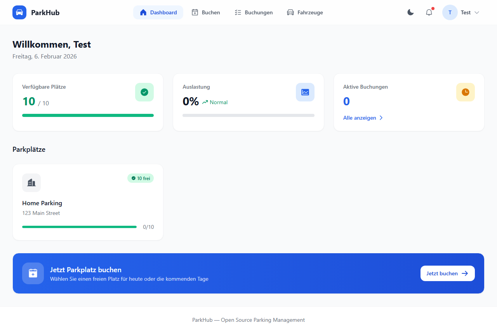
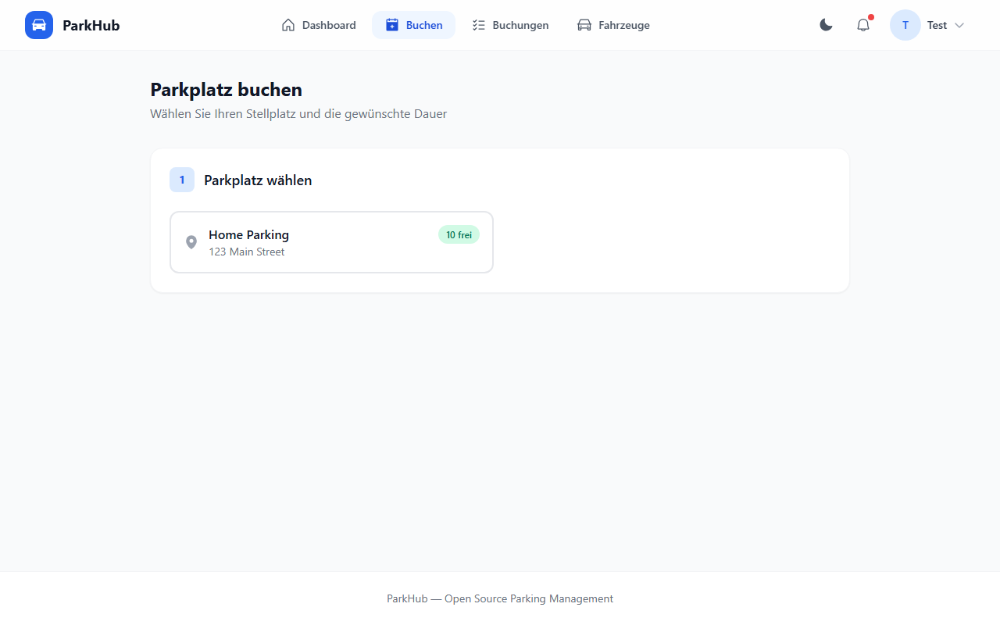
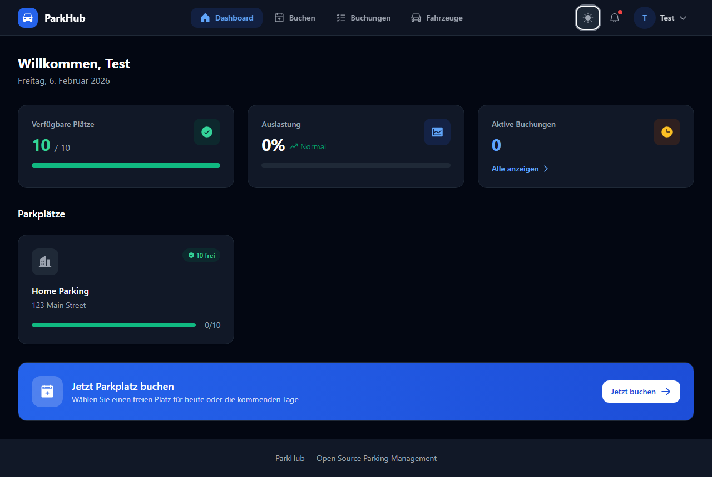

<p align="center">
  
</p>

<h1 align="center">ParkHub — Self-Hosted Parking Management</h1>

<p align="center">
  <a href="https://github.com/nash87/parkhub-rust/actions/workflows/ci.yml"></a>
  <a href="CHANGELOG.md"></a>
  <a href="LICENSE"></a>
  <a href="https://www.rust-lang.org/"></a>
  <a href="https://react.dev/"></a>
  
  <a href="docs/GDPR.md"></a>
  <a href="COMPLIANCE-REPORT.md"></a>
  <a href="docker-compose.yml"></a>
</p>

<p align="center">
  <strong>Ihre Daten. Ihr Server. Ihre Kontrolle.</strong><br>
  The on-premise parking management platform for enterprises, universities, and residential complexes.<br>
  Ships as a <strong>single binary</strong> with zero external dependencies. Zero cloud. Zero tracking.<br>
  100% GDPR compliant by design.
</p>

<p align="center">
  <a href="https://parkhub-rust-demo.onrender.com"><strong>Try the Live Demo</strong></a> &nbsp;·&nbsp;
  <a href="docs/INSTALLATION.md">Installation</a> &nbsp;·&nbsp;
  <a href="docs/API.md">API Docs</a> &nbsp;·&nbsp;
  <a href="docs/GDPR.md">GDPR Guide</a> &nbsp;·&nbsp;
  <a href="CHANGELOG.md">Changelog</a> &nbsp;·&nbsp;
  <a href="SECURITY.md">Security</a>
</p>

---

## Why Self-Hosted?

Most parking management SaaS costs 200--2,000 EUR/month, stores your data on US cloud infrastructure, and requires a data processing agreement just to get started.

ParkHub is different. It runs on your server -- a Raspberry Pi, a VPS, or your company network. Your data never leaves your premises, which means **no GDPR processor agreement needed**, no CLOUD Act exposure, and no monthly fees. The entire source code is MIT-licensed and auditable.

---

## Quick Start

### Docker (recommended)

```bash
git clone https://github.com/nash87/parkhub-rust.git && cd parkhub-rust
docker compose up -d
# Open http://localhost:8080 — admin password is in the logs
```

The first build takes 5--10 minutes (compiles Rust + React from source). After that, starts are instant.

### Native binary

```bash
cargo build --release --package parkhub-server --no-default-features --features headless
./target/release/parkhub-server --headless --unattended --port 8080
```

**[Live Demo](https://parkhub-rust-demo.onrender.com)** | Login: `admin@parkhub.test` / `demo` | (auto-resets every 6 hours)

---

## Features

### v2.9.0 Highlights

- **Lobby Display / Kiosk Mode** -- Full-screen public display at `/lobby/:lotId` for parking garage monitors (no auth, auto-refresh, per-floor breakdown)
- **Interactive Onboarding Wizard** -- 4-step setup wizard at `/setup` (company info, create lot, invite users, pick theme)
- **WebSocket real-time updates** -- Live booking/occupancy events with token auth, heartbeat, and auto-reconnect
- **API architecture overhaul** -- mod.rs reduced from 4500 to 1500 lines via Phase 3 handler extraction
- **12 switchable themes** -- Classic, Glass, Bento, Brutalist, Neon, Warm, Wabi-Sabi, Scandinavian, Cyberpunk, Terracotta, Oceanic, Art Deco
- **httpOnly cookie auth** -- XSS-proof authentication with SameSite=Lax and CSRF protection
- **OAuth/Social login** -- Self-service Google + GitHub OAuth (users configure their own apps)
- **Glass morphism UI** -- Bento grid dashboard with animated counters, spring physics, frosted-glass cards
- **2FA/TOTP authentication** -- QR code enrollment, backup codes, per-account enable/disable
- **Dynamic pricing** -- Occupancy-based surge/discount pricing with admin-configurable thresholds
- **Operating hours** -- Per-lot 7-day schedule with booking validation and "Open Now" badges
- **SMS/WhatsApp stubs** -- Notification channel expansion with per-event toggles
- **PDF invoices** -- Professional booking invoices with VAT breakdown
- **28 Cargo feature flags** -- Build only the modules you need (see [Module System](#module-system))
- **Lighthouse CI** -- Automated accessibility (>= 95), performance (>= 90), SEO (>= 95) gates
- **Smart recommendations** -- Heuristic scoring engine that learns from usage patterns
- **Community translations** -- 10 languages with proposal voting and admin review

### Core

- **Full booking lifecycle** -- One-tap quick booking, recurring reservations, guest bookings, swap requests, waitlists, automatic no-show release
- **Visual lot editor** -- Per-floor interactive grid layouts with drag-and-drop, real-time occupancy, color-coded availability
- **4-tier RBAC** -- User, premium, admin, superadmin with JWT session auth and token refresh
- **Credits system** -- Monthly quotas with per-booking deduction
- **Absence tracking** -- Homeoffice, vacation, sick leave with team overview and iCal import
- **Admin dashboard** -- Occupancy stats, 7-day booking charts, weekday/hour heatmaps, CSV export, announcements
- **10 languages** -- EN, DE, FR, ES, IT, PT, TR, PL, JA, ZH with runtime hot-loading
- **GDPR & German legal compliance** -- Art. 15/17, DDG SS5, 7 legal templates, audited for DSGVO/TTDSG/UK GDPR/CCPA/nDSG
- **Observability** -- Prometheus metrics, OpenAPI 3.0 with 125+ endpoints at `/swagger-ui`, K8s health probes, structured tracing

### Security

- **httpOnly cookie auth** with SameSite=Lax (XSS-proof, Bearer fallback for APIs)
- Argon2id password hashing (wrapped in spawn_blocking)
- Optional AES-256-GCM database encryption at rest
- Auto-generated TLS 1.3 certificates (rustls, no OpenSSL)
- Constant-time token comparison (subtle crate)
- IP-based rate limiting (5 login/min, 100 req/s global)
- Nonce-based CSP + HSTS + security headers
- Input length validation on all endpoints
- Password change invalidates other sessions
- Login history tracking with IP/user-agent
- Session management (list/revoke active tokens)
- API key authentication support
- 4 MiB request body limit
- Complete audit log

---

## Screenshots

| | |
|---|---|
|  |  |
| Dashboard with occupancy stats | Interactive booking flow |
|  |  |
| Admin panel with layout editor | Full dark mode support |

---

## Architecture

```
                    ┌─────────────────────────────────┐
                    │     React 19 + Astro 6 SPA      │
                    │   TypeScript · Tailwind CSS 4    │
                    └───────────────┬─────────────────┘
                                    │ httpOnly Cookie + Bearer Token
                    ┌───────────────▼─────────────────┐
                    │       Axum 0.8 HTTP Server       │
                    │   /api/v1/*  · /swagger-ui       │
                    │   /metrics   · /health           │
                    ├─────────────────────────────────┤
                    │  redb (embedded key-value DB)    │
                    │  Optional AES-256-GCM at rest    │
                    └─────────────────────────────────┘
                          Single Rust binary (~15 MB)
```

The entire stack -- API server, database, and frontend -- compiles into a **single binary**. No PostgreSQL, no Redis, no nginx. Just download and run. The React frontend is embedded via `rust-embed` and served as static files.

For LAN deployments, mDNS autodiscovery lets clients find the server without any DNS configuration. A desktop client (Slint UI) with system tray integration is available for Windows and macOS.

---

## Module System

ParkHub uses Cargo feature flags to let you build only the modules you need. The `full` feature enables everything. Use `--no-default-features --features headless` for a minimal server build, then add individual modules as needed.

| Flag | Description |
|------|-------------|
| `mod-bookings` | Core booking lifecycle (create, cancel, check-in) |
| `mod-vehicles` | Vehicle registry with licence plate management |
| `mod-absences` | Homeoffice, vacation, sick leave tracking |
| `mod-branding` | Custom logo, colors, company name |
| `mod-import` | Bulk user import (CSV, up to 500 users) |
| `mod-qr` | QR code generation for bookings and slots |
| `mod-pwa` | Progressive Web App (service worker, manifest) |
| `mod-payments` | Credits and payment processing |
| `mod-webhooks` | Outbound webhooks with HMAC signing |
| `mod-notifications` | In-app notification system |
| `mod-announcements` | Admin announcements with expiry |
| `mod-recurring` | Recurring booking patterns |
| `mod-guest` | Guest bookings without user accounts |
| `mod-calendar` | Calendar view and iCal export |
| `mod-team` | Team overview and today's status |
| `mod-settings` | Application settings management |
| `mod-jobs` | Background job processing |
| `mod-swap` | Booking swap requests between users |
| `mod-waitlist` | Waitlist for fully occupied lots |
| `mod-zones` | Per-lot zone management |
| `mod-credits` | Monthly credit quotas |
| `mod-email` | SMTP email notifications |
| `mod-export` | CSV data export |
| `mod-favorites` | Favourite slot pinning |
| `mod-push` | Web Push notifications (VAPID) |
| `mod-recommendations` | Smart slot recommendation engine |
| `mod-translations` | Community translation management |
| `mod-social` | Social features |
| `mod-themes` | 12 switchable design themes |
| `mod-invoices` | PDF invoice generation with VAT |
| `mod-dynamic-pricing` | Occupancy-based surge/discount pricing |
| `mod-operating-hours` | Per-lot 7-day schedule |
| `mod-oauth` | OAuth/Social login (Google, GitHub) |
| `gui` | Slint desktop GUI with system tray |
| `headless` | Server-only mode (no GUI dependencies) |

Example: build a minimal server with just bookings and email:

```bash
cargo build --release -p parkhub-server --no-default-features \
  --features "headless,mod-bookings,mod-email"
```

---

## Deployment

ParkHub runs anywhere -- from a Raspberry Pi to Kubernetes.

- **Docker Compose** (recommended) -- `docker compose up -d` and you're done
- **Kubernetes** -- Health probes, Prometheus metrics, Helm-ready manifests, designed for GitOps with Flux CD
- **Bare Metal** -- Download the single binary, run it. No runtime dependencies. x86_64 and ARM64
- **Windows** -- GUI installer with system tray icon and setup wizard

See [docs/INSTALLATION.md](docs/INSTALLATION.md) for detailed guides.

---

## Testing

**1,339+ tests** across Rust backend (813), React frontend (461), and E2E Playwright (65). Clippy runs in pedantic + nursery mode with zero warnings. Lighthouse CI enforces accessibility >= 95, performance >= 90.

```bash
cargo test --workspace           # Rust backend
cd parkhub-web && npx vitest run # Frontend
npx playwright test              # E2E
```

---

## Configuration

All configuration via environment variables or `config.toml`. Key settings:

| Variable | Purpose |
|----------|---------|
| `PARKHUB_DB_PASSPHRASE` | Enable AES-256-GCM database encryption |
| `SMTP_HOST` / `SMTP_USER` / `SMTP_PASS` | Email notifications |
| `PARKHUB_ADMIN_PASSWORD` | Set admin password (auto-generated if omitted) |
| `DEMO_MODE=true` | Enable demo overlay with 6-hour auto-reset |
| `OAUTH_GOOGLE_CLIENT_ID` | Google OAuth client ID (free at console.cloud.google.com) |
| `OAUTH_GOOGLE_CLIENT_SECRET` | Google OAuth client secret |
| `OAUTH_GITHUB_CLIENT_ID` | GitHub OAuth client ID (free at github.com/settings/developers) |
| `OAUTH_GITHUB_CLIENT_SECRET` | GitHub OAuth client secret |
| `RUST_LOG=info` | Log level |

Full reference: [docs/CONFIGURATION.md](docs/CONFIGURATION.md)

---

## API Documentation

Interactive API docs are available at `/swagger-ui` when the server is running. The OpenAPI 3.0 spec covers 125+ annotated endpoints across auth, bookings, lots, vehicles, admin, GDPR, and more.

**[Live API Docs](https://parkhub-rust-demo.onrender.com/swagger-ui)**

---

## PHP Edition

A feature-equivalent **PHP edition** (Laravel 12 + MySQL/SQLite/PostgreSQL) exists for environments where shared hosting compatibility matters. Both editions share the same React frontend and REST API surface, so they're fully interchangeable.

**[nash87/parkhub-php](https://github.com/nash87/parkhub-php)**

---

## Contributing

Contributions welcome -- see [docs/CONTRIBUTING.md](docs/CONTRIBUTING.md) for setup and PR process.

Bug reports and feature requests: [GitHub Issues](https://github.com/nash87/parkhub-rust/issues)

---

## License

MIT -- see [LICENSE](LICENSE).

The default build includes [Slint](https://slint.dev/) for the desktop GUI (GPL-3.0 community edition). Server/Docker builds use `--features headless` and are purely MIT. See [LICENSES.md](LICENSES.md) for the full dependency license inventory.
